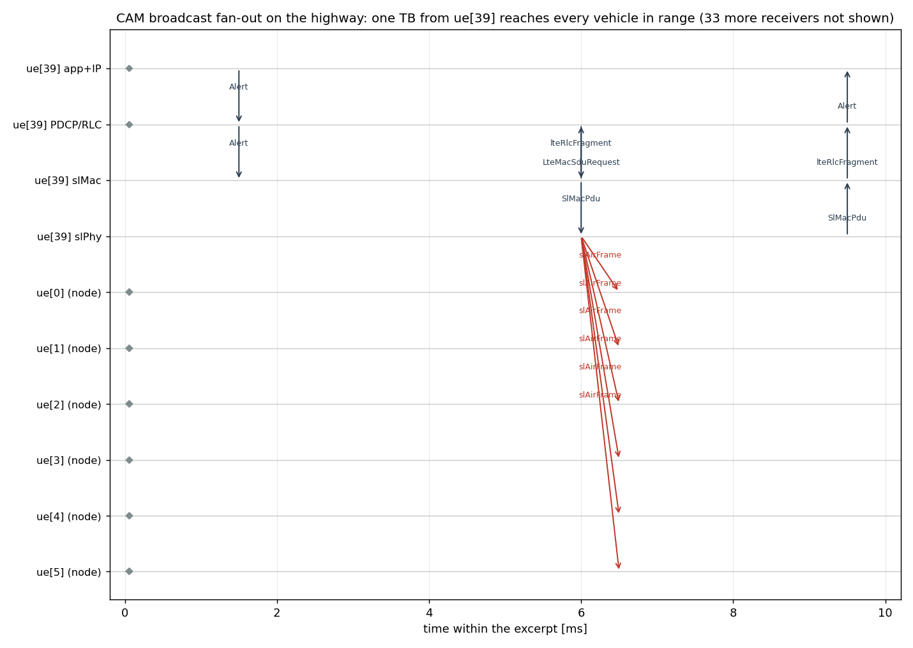
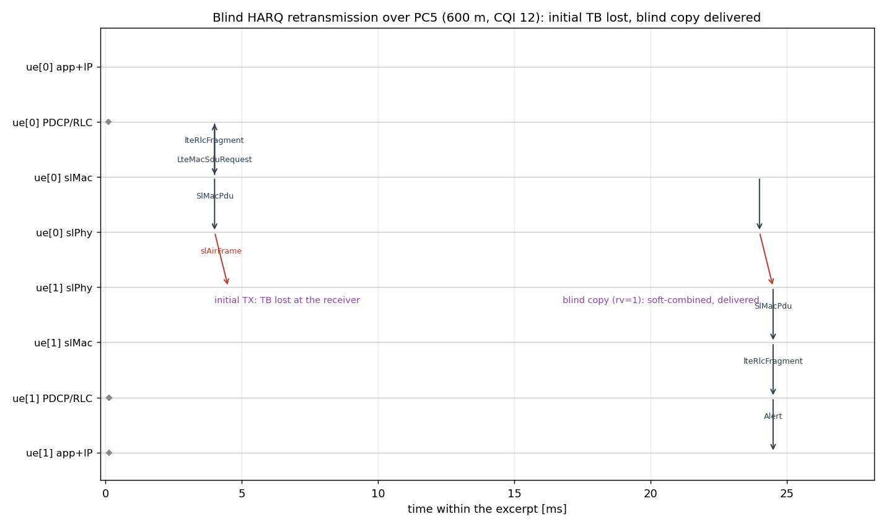

# NR Sidelink Mode 2 on a Highway — a Mini-Showcase

This page walks through the TR 37.885 highway example of the NR sidelink
(PC5) package: what it models, which behaviors it demonstrates, how each of
them is tested, and what the recorded results look like. Everything below is
reproducible with the commands shown; the images are generated from actual
simulation output (no IDE needed).

## The scenario

170 vehicles drive along a gently curved 2 km, 6-lane highway (3 lanes per
direction, 100 km/h) with **no cellular infrastructure at all** — no gNodeB,
no core network. Every vehicle broadcasts CAM-style periodic messages
(300 B @ 10 Hz) to all others over the PC5 sidelink:

- **Resource allocation** is TS 38.321 §5.22 *mode 2*: each UE autonomously
  selects its periodic resource by sensing the SCIs of its neighbors,
  excluding resources reserved by them, and keeping the selection for a
  random 5–15 periods (SPS with reselection counter).
- **The channel** is the TR 37.885 V2V highway model: LOS pathloss with
  per-pair shadowing, SINR with co-slot/co-subchannel interference from all
  concurrent transmissions, PSCCH threshold decoding and PSSCH decoding
  against the per-CQI BLER curves.
- **The pool** is 5 subchannels × 10 PRBs at 5.9 GHz, numerology 1
  (0.5 ms slots), 100 ms reservation period.

The vehicles drive on arcs of a 4 km-radius circle; the road (asphalt, lane
markings, center divider) is drawn with canvas figures of the same circle,
so the Qtenv view shows vehicles moving along a plausible curved highway.

## Behaviors demonstrated, and where each is verified

| Behavior | Demonstrated by | Verified by |
|---|---|---|
| Out-of-coverage PC5 (cell-less UEs) | every config here | `OutOfCoverage` fingerprint row; WP-A audit |
| Mode-2 sensing-based selection, 20% rule, SPS | `Highway*` configs | 29 deterministic unit tests (`tests/unit/sidelink/runtest`); sensing-gain A/B: PRR **98.2%** (mode 2) vs **77.7%** (random) in `basic/Mode2-50UE` vs `Random-50UE` |
| TR 37.885 pathloss + BLER decoding | SINR distribution below | constants verified against the spec (ns-3 cross-check); PER-vs-distance sweep in `basic/README.txt` (knee at ~600 m @ CQI 12) |
| CAM broadcast fan-out | sequence chart below | app-level delivery counts; `Highway-Small` fingerprint row |
| Blind HARQ retransmission + soft combining + dedup | sequence chart below | 16/48 → 48/48 delivered at the PER knee (`basic/Broadcast-Tr37885-BlindRetx`) |
| CBR measurement (TS 38.215) | CBR chart below | value matches the analytic occupancy (170 tx / 1000 subchannel-slots ≈ 0.17) |
| PRR / PIR per distance bin (TR 37.885 §6.1.5) | PRR/PIR chart below | `SlStatsCollector` scalars; monotone PRR curve |
| Scalability | `Highway-300` config | 300 vehicles: ~72 s wall / ~1 GB RSS per 2 s simulated (release); ~16% faster with `slTxRange=1000m` pruning |

## Analysis charts (highway.anf)

The charts live in [highway.anf](../highway.anf) — open it in the IDE's
Analysis editor, or export headlessly:

```
opp_charttool imageexport -p inet-4.5.4=$INET_ROOT simu5G=$SIMU5G_ROOT \
    -f png -d doc/media highway.anf
```

**PRR and PIR vs distance.** PRR falls monotonically 0.993 → 0.972 over
0–500 m (total 0.981); PIR sits at the 100 ms CAM period, as expected for
near-unity PRR. Losses are collision/half-duplex dominated — the LOS channel
is not the limit at these distances. Compared to published 5G-LENA mode-2
highway curves this is on the optimistic side; the known modeling deltas
(LOS-only, no fast fading, ideal sync, threshold SCI decode) are listed in
the README.


**Channel busy ratio.** Every UE measures CBR over a sliding 100-slot window
from per-subchannel RSSI, updated only at slot-end processing (the package
has no per-slot ticker anywhere). All observed UEs agree on ~0.165, matching
the analytic pool occupancy (170 transmitters × 1 subchannel-slot per 100 ms
over a 5 × 2000 subchannel-slot/s pool).


**SL SINR distribution.** The mode sits at ~22 dB with a tail up to ~66 dB
(vehicles meters apart) and a small sub-0 dB tail — co-slot interference and
distant senders; these are the receptions that fail SCI or TB decoding.


## Sequence charts

Rendered from recorded eventlogs by
[make-sequence-charts.py](make-sequence-charts.py) (IDE-style lifelines ×
time, arrows are actual eventlog message sends). Record the inputs with:

```
# fan-out chart input (in this directory):
simu5g -u Cmdenv -c Highway-Small --sim-time-limit=0.3s \
    --record-eventlog=true --eventlog-file='results/Highway-Small/seqchart.elog' omnetpp.ini

# blind-HARQ chart input (in ../basic):
simu5g -u Cmdenv -c Broadcast-Tr37885-BlindRetx --sim-time-limit=0.3s \
    --record-eventlog=true --eventlog-file='results/Broadcast-Tr37885-BlindRetx/seqchart.elog' \
    --'*.ue[1].mobility.initialX'=890m \
    --'*.ue[*].cellularNic.slChannelModel.shadowing'=false \
    --'*.ue[*].cellularNic.slMac.grantMcs'=12 omnetpp.ini
```

**One CAM broadcast, fanned out to every vehicle in range.** The Alert
descends the sender's stack (the paired `LteMacSduRequest`/`lteRlcFragment`
exchange is the MAC pulling a PDU from RLC at the grant's TX slot), the
`SlAirFrame` reaches every vehicle's slPhy in the same slot, and each
receiver that decodes the TB pushes it up to its app. The chart also catches
the sender itself *receiving* a neighbor's CAM a couple of slots later —
every vehicle is both source and sink.



**Blind HARQ retransmission.** At 600 m / CQI 12 the first copy of this TB
arrives below the decoding threshold and dies at the receiver's PHY (nothing
goes up). One reservation period (20 ms) later the sender's HARQ entity
transmits the blind copy — note: no `LteMacSduRequest`, the copy comes from
the HARQ buffer, not RLC — the receiver soft-combines (error probability
scaled by `harqReduction^(attempt-1)`) and the Alert completes its journey.
Had the first copy been decoded, the second would have been suppressed as a
duplicate by (source, HARQ process, NDI).



## Known issue (analysis tooling)

On the current omnetpp-dev build, `omnetpp.scave.results.get_vectors()` (the
standalone Python scave bindings used by `opp_charttool`) returns corrupted
vector data — values spliced from other vectors or fabricated — while
`opp_scavetool export` reads the same files correctly (suspected object
lifetime issue around `readVectorsIntoArrays` in the nanobind bindings).
The two vector-based charts in `highway.anf` therefore parse the text `.vec`
file directly; switch them back to `results.get_vectors()` once the bindings
are fixed. Minimal repro:

```
cd simulations/nr/sidelink/highway   # after running the Highway config
python3 -c "from omnetpp.scave import results; results.set_inputs(['results/Highway/0.vec']); \
print(results.get_vectors('name =~ \"slSinr:vector\" AND module =~ \"*.ue[0].*\"').iloc[0]['vecvalue'][:6])"
opp_scavetool export -f 'name =~ "slSinr:vector" AND module =~ "*.ue[0].*"' -F CSV-R -o /tmp/x.csv results/Highway/0.vec
# the two outputs disagree; the CSV matches the raw file
```
